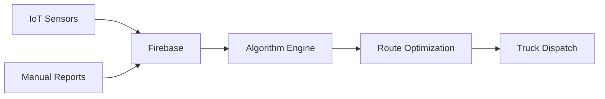

# 🚛 Smart Waste Collection Algorithms

Advanced routing algorithms for intelligent waste management system with real-time IoT integration and Firebase sync.

## 📋 Table of Contents
- [Overview](#overview)
- [Core Algorithms](#core-algorithms)
- [Implementation Details](#implementation-details)
- [Performance](#performance)
- [API Integration](#api-integration)

## Overview

This system implements multiple optimization algorithms for smart waste collection in urban environments, featuring:
- **Real-time route optimization** using modified Dijkstra algorithm
- **IoT sensor integration** for dynamic fill-level monitoring
- **Predictive analytics** for waste generation patterns
- **OpenStreetMap integration** for real-world routing

## Core Algorithms

### 1. Enhanced Dijkstra Algorithm

Modified Dijkstra implementation with weighted factors for waste collection optimization.

```javascript
calculateDijkstra(startPoint, targetPoints) {
    const n = allPoints.length;
    const distances = Array(n).fill(Infinity);
    const visited = Array(n).fill(false);
    
    distances[0] = 0;
    
    for (let i = 0; i < n; i++) {
        let minIndex = findMinDistance(distances, visited);
        visited[minIndex] = true;
        updateNeighbors(minIndex, distances, visited);
    }
    
    return buildOptimalRoute(distances, targetPoints);
}
```

**Weight Factors:**
- Priority multiplier: `0.5x` for high-priority points
- Urgency multiplier: `0.3x` for manual reports
- Distance: Haversine formula for GPS coordinates

### 2. Gravitational Attraction System

Dynamic point selection based on multiple factors:

```javascript
attractionForce = (fillLevel * priority * urgency) / (distance + 0.1)
```

**Parameters:**
| Parameter | Range | Description |
|-----------|-------|-------------|
| fillLevel | 0-100 | Container fill percentage |
| priority | 1-2 | Normal (1) or High (2) |
| urgency | 1-3 | Standard (1) or Manual report (3) |
| distance | km | Euclidean distance from truck |

### 3. Predictive Fill Rate Algorithm

Machine learning-inspired approach for predicting container fill rates:

```javascript
calculateFillRate(category) {
    const baseRates = {
        'RESTAURANTS': 2.5,     // High generation
        'OFFICES': 1.5,         // Medium generation
        'RESIDENTIAL': 0.8      // Low generation
    };
    
    // Add temporal factors
    const timeFactor = getTimeOfDayFactor();
    const dayFactor = getDayOfWeekFactor();
    
    return baseRates[category] * timeFactor * dayFactor;
}
```

### 4. Auto-Dispatch Intelligence

Autonomous dispatch system for emergency situations:

```javascript
autoDispatch() {
    const urgentPoints = points.filter(p => 
        p.fillLevel > 90 || 
        p.priority === 'high' || 
        p.source === 'manual_report'
    );
    
    if (urgentPoints.length > threshold) {
        const nearestTruck = findOptimalTruck(urgentPoints);
        initiateDijkstraRoute(nearestTruck);
    }
}
```

## Implementation Details

### Real-time Data Flow



### Collection Simulation

The Pac-Man inspired collection algorithm:

```javascript
collectWaste(truck, point) {
    const collected = Math.min(point.fillLevel, truck.remainingCapacity);
    point.fillLevel -= collected;
    truck.currentLoad += collected;
    
    // Real-time sync
    updateFirebase({
        pointId: point.id,
        newLevel: point.fillLevel,
        timestamp: Date.now()
    });
}
```

## Performance

### Optimization Metrics

- **Route Efficiency**: `(points × priority) / (distance × time)`
- **Collection Rate**: Average 80% fill level before collection
- **Response Time**: < 3s for route calculation with 100 points

### Complexity Analysis

| Algorithm | Time Complexity | Space Complexity |
|-----------|----------------|------------------|
| Dijkstra | O(V²) | O(V) |
| Attraction | O(n) | O(1) |
| Fill Rate | O(1) | O(1) |

## API Integration

### OpenStreetMap Routing

```javascript
async getOSMRoute(start, end) {
    const response = await fetch(
        `https://router.project-osrm.org/route/v1/driving/
         ${start.lng},${start.lat};${end.lng},${end.lat}`
    );
    
    return {
        distance: route.distance / 1000,    // km
        duration: route.duration / 60,      // minutes
        geometry: route.geometry
    };
}
```

### Firebase Real-time Listeners

```javascript
// Truck updates
firebase.database().ref('trucks').on('value', updateTrucks);

// Waste point updates
firebase.database().ref('wastePoints').on('value', updatePoints);

// IoT sensor data
firebase.database().ref('sensors').on('value', updateSensors);
```

## Configuration

### Environment Variables

```env
FIREBASE_API_KEY=your_api_key
FIREBASE_PROJECT_ID=your_project_id
OSRM_SERVER=https://router.project-osrm.org
```

### Algorithm Parameters

```javascript
const config = {
    dijkstra: {
        maxPoints: 10,
        priorityWeight: 0.5,
        urgencyWeight: 0.3
    },
    attraction: {
        threshold: 0.3,
        maxDistance: 5.0  // km
    },
    autoDispatch: {
        urgentThreshold: 90,  // %
        checkInterval: 300000 // 5 minutes
    }
};
```

## Usage Example

```javascript
// Initialize system
const wasteSystem = new SmartWasteSystem(config);

// Add real-time listeners
wasteSystem.connectFirebase();

// Start auto-dispatch
wasteSystem.enableAutoDispatch();

// Calculate route for specific truck
const route = await wasteSystem.calculateOptimalRoute('TRUCK-001');
```

## Contributing

Contributions are welcome! Please read our [Contributing Guidelines](CONTRIBUTING.md) first.

## License

This project is licensed under the MIT License - see the [LICENSE](LICENSE) file for details.

## Acknowledgments

- OpenStreetMap for routing data
- Firebase for real-time synchronization
- Inspired by urban waste management systems in Catania, Italy

---

**Note**: This is a simplified version of production algorithms. For complete implementation, refer to the full codebase.
