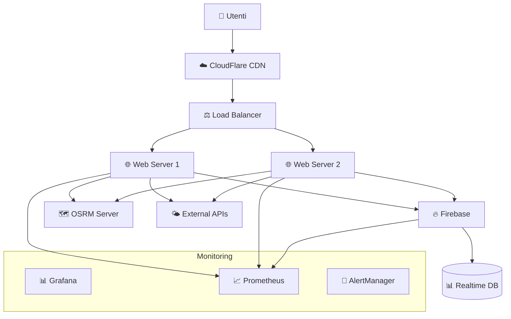
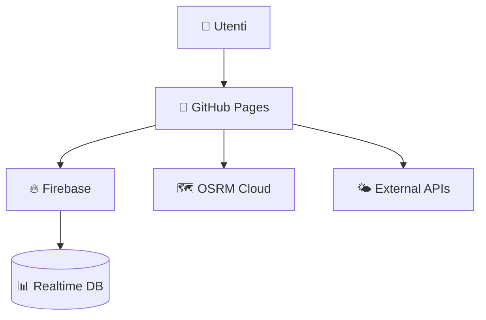

## 🔄 CI/CD Pipeline

### 🐙 **GitHub Actions Workflow**

```yaml
# .github/workflows/deploy.yml
name: Deploy Catania Smart Waste Dashboard

on:
  push:
    branches: [ main, develop ]
  pull_request:
    branches: [ main ]

env:
  NODE_VERSION: '18'
  FIREBASE_PROJECT_ID: catania-smart-waste

jobs:
  test:
    runs-on: ubuntu-latest
    steps:
      - name: Checkout code
        uses: actions/checkout@v4

      - name: Setup Node.js
        uses: actions/setup-node@v4
        with:
          node-version: ${{ env.NODE_VERSION }}
          cache: 'npm'

      - name: Install dependencies
        run: npm ci

      - name: Run linting
        run: npm run lint

      - name: Run type checking
        run: npm run type-check

      - name: Run unit tests
        run: npm run test:unit

      - name: Run integration tests
        run: npm run test:integration

      - name: Generate test coverage
        run: npm run coverage

      - name: Upload coverage to Codecov
        uses: codecov/codecov-action@v3
        with:
          file: ./coverage/lcov.info

  security:
    runs-on: ubuntu-latest
    steps:
      - name: Checkout code
        uses: actions/checkout@v4

      - name: Run security audit
        run: npm audit --audit-level high

      - name: Run Snyk security scan
        uses: snyk/actions/node@master
        env:
          SNYK_TOKEN: ${{ secrets.SNYK_TOKEN }}

  build:
    runs-on: ubuntu-latest
    needs: [test, security]
    if: github.ref == 'refs/heads/main'
    
    steps:
      - name: Checkout code
        uses: actions/checkout@v4

      - name: Setup Node.js
        uses: actions/setup-node@v4
        with:
          node-version: ${{ env.NODE_VERSION }}
          cache: 'npm'

      - name: Install dependencies
        run: npm ci

      - name: Build application
        run: npm run build
        env:
          VITE_FIREBASE_API_KEY: ${{ secrets.FIREBASE_API_KEY }}
          VITE_FIREBASE_AUTH_DOMAIN: ${{ secrets.FIREBASE_AUTH_DOMAIN }}
          VITE_FIREBASE_DATABASE_URL: ${{ secrets.FIREBASE_DATABASE_URL }}
          VITE_FIREBASE_PROJECT_ID: ${{ secrets.FIREBASE_PROJECT_ID }}
          VITE_OPENWEATHER_API_KEY: ${{ secrets.OPENWEATHER_API_KEY }}

      - name: Upload build artifacts
        uses: actions/upload-artifact@v3
        with:
          name: build-files
          path: dist/

  deploy-staging:
    runs-on: ubuntu-latest
    needs: build
    if: github.ref == 'refs/heads/develop'
    environment: staging
    
    steps:
      - name: Download build artifacts
        uses: actions/download-artifact@v3
        with:
          name: build-files
          path: dist/

      - name: Deploy to Firebase Staging
        uses: FirebaseExtended/action-hosting-deploy@v0
        with:
          repoToken: ${{ secrets.GITHUB_TOKEN }}
          firebaseServiceAccount: ${{ secrets.FIREBASE_SERVICE_ACCOUNT_STAGING }}
          projectId: ${{ env.FIREBASE_PROJECT_ID }}-staging
          channelId: live

  deploy-production:
    runs-on: ubuntu-latest
    needs: build
    if: github.ref == 'refs/heads/main'
    environment: production
    
    steps:
      - name: Download build artifacts
        uses: actions/download-artifact@v3
        with:
          name: build-files
          path: dist/

      - name: Deploy to Firebase Production
        uses: FirebaseExtended/action-hosting-deploy@v0
        with:
          repoToken: ${{ secrets.GITHUB_TOKEN }}
          firebaseServiceAccount: ${{ secrets.FIREBASE_SERVICE_ACCOUNT_PRODUCTION }}
          projectId: ${{ env.FIREBASE_PROJECT_ID }}
          channelId: live

      - name: Notify Slack on success
        if: success()
        uses: 8398a7/action-slack@v3
        with:
          status: success
          channel: '#catania-waste-deployments'
          text: '🚀 Production deployment successful!'
        env:
          SLACK_WEBHOOK_URL: ${{ secrets.SLACK_WEBHOOK_URL }}

      - name: Notify Slack on failure
        if: failure()
        uses: 8398a7/action-slack@v3
        with:
          status: failure
          channel: '#catania-waste-deployments'
          text: '❌ Production deployment failed!'
        env:
          SLACK_WEBHOOK_URL: ${{ secrets.SLACK_WEBHOOK_URL }}

  performance-test:
    runs-on: ubuntu-latest
    needs: deploy-staging
    if: github.ref == 'refs/heads/develop'
    
    steps:
      - name: Checkout code
        uses: actions/checkout@v4

      - name: Run Lighthouse CI
        uses: treosh/lighthouse-ci-action@v10
        with:
          configPath: './.lighthouserc.js'
          uploadArtifacts: true
          temporaryPublicStorage: true

  e2e-tests:
    runs-on: ubuntu-latest
    needs: deploy-staging
    if: github.ref == 'refs/heads/develop'
    
    steps:
      - name: Checkout code
        uses: actions/checkout@v4

      - name: Setup Node.js
        uses: actions/setup-node@v4
        with:
          node-version: ${{ env.NODE_VERSION }}

      - name: Install Playwright
        run: npx playwright install

      - name: Run E2E tests
        run: npm run test:e2e
        env:
          BASE_URL: https://${{ env.FIREBASE_PROJECT_ID }}-staging.web.app

      - name: Upload E2E test results
        uses: actions/upload-artifact@v3
        if: always()
        with:
          name: e2e-results
          path: test-results/
```

### 🧪 **Testing Configuration**

```javascript
// playwright.config.js
import { defineConfig, devices } from '@playwright/test';

export default defineConfig({
  testDir: './tests/e2e',
  fullyParallel: true,
  forbidOnly: !!process.env.CI,
  retries: process.env.CI ? 2 : 0,
  workers: process.env.CI ? 1 : undefined,
  reporter: 'html',
  
  use: {
    baseURL: process.env.BASE_URL || 'http://localhost:3000',
    trace: 'on-first-retry',
    screenshot: 'only-on-failure'
  },

  projects: [
    {
      name: 'chromium',
      use: { ...devices['Desktop Chrome'] },
    },
    {
      name: 'firefox',
      use: { ...devices['Desktop Firefox'] },
    },
    {
      name: 'webkit',
      use: { ...devices['Desktop Safari'] },
    },
    {
      name: 'Mobile Chrome',
      use: { ...devices['Pixel 5'] },
    },
    {
      name: 'Mobile Safari',
      use: { ...devices['iPhone 12'] },
    }
  ],

  webServer: {
    command: 'npm run preview',
    port: 4173,
    reuseExistingServer: !process.env.CI
  }
});
```

```javascript
// tests/e2e/dashboard.spec.js
import { test, expect } from '@playwright/test';

test.describe('Catania Waste Dashboard', () => {
  test.beforeEach(async ({ page }) => {
    await page.goto('/');
  });

  test('should load dashboard successfully', async ({ page }) => {
    await expect(page).toHaveTitle(/Catania Smart Waste/);
    await expect(page.locator('#map')).toBeVisible();
    await expect(page.locator('.sidebar')).toBeVisible();
  });

  test('should display waste points on map', async ({ page }) => {
    // Wait for map to load
    await page.waitForSelector('.leaflet-map-pane');
    
    // Wait for markers to appear
    await page.waitForSelector('.waste-point-icon', { timeout: 10000 });
    
    const markerCount = await page.locator('.waste-point-icon').count();
    expect(markerCount).toBeGreaterThan(100);
  });

  test('should filter waste points by type', async ({ page }) => {
    // Click on organico filter
    await page.click('[data-type="organico"]');
    
    // Wait for filtering
    await page.waitForTimeout(1000);
    
    // Check that only organico markers are visible
    const markers = page.locator('.waste-point-icon');
    const markerCount = await markers.count();
    
    // Verify markers have organico styling
    for (let i = 0; i < Math.min(5, markerCount); i++) {
      const marker = markers.nth(i);
      const bgColor = await marker.evaluate(el => 
        getComputedStyle(el.firstChild).backgroundColor
      );
      expect(bgColor).toContain('76, 175, 80'); // Green color for organico
    }
  });

  test('should calculate route for truck', async ({ page }) => {
    // Find active truck
    const activeTruck = page.locator('.truck-card .status-active').first();
    await expect(activeTruck).toBeVisible();
    
    // Click route button
    const routeButton = activeTruck.locator('..').locator('.route-btn');
    await routeButton.click();
    
    // Wait for route calculation
    await page.waitForSelector('.leaflet-overlay-pane path', { timeout: 15000 });
    
    // Verify route is drawn
    const routeLines = page.locator('.leaflet-overlay-pane path');
    const lineCount = await routeLines.count();
    expect(lineCount).toBeGreaterThan(0);
  });

  test('should open waste point modal on click', async ({ page }) => {
    // Wait for markers to load
    await page.waitForSelector('.waste-point-icon');
    
    // Click on first marker
    await page.locator('.waste-point-icon').first().click();
    
    // Wait for modal to appear
    await expect(page.locator('#report-modal')).toBeVisible();
    
    // Check modal content
    await expect(page.locator('.modal-title')).toHaveText('Segnala Stato Contenitore');
    await expect(page.locator('.status-btn')).toHaveCount(4);
  });

  test('should be responsive on mobile', async ({ page }) => {
    await page.setViewportSize({ width: 375, height: 667 });
    
    // Check mobile layout
    await expect(page.locator('.sidebar')).toHaveCSS('max-height', '300px');
    await expect(page.locator('.dashboard')).toHaveCSS('grid-template-columns', '1fr');
  });
});
```

### 🔍 **Performance Testing**

```javascript
// .lighthouserc.js
module.exports = {
  ci: {
    collect: {
      url: [
        'http://localhost:3000/',
        'http://localhost:3000/?filter=organico'
      ],
      numberOfRuns: 3,
      settings: {
        chromeFlags: '--no-sandbox --headless'
      }
    },
    assert: {
      assertions: {
        'categories:performance': ['warn', { minScore: 0.8 }],
        'categories:accessibility': ['error', { minScore: 0.9 }],
        'categories:best-practices': ['warn', { minScore: 0.85 }],
        'categories:seo': ['warn', { minScore: 0.8 }],
        'first-contentful-paint': ['warn', { maxNumericValue: 2000 }],
        'largest-contentful-paint': ['warn', { maxNumericValue: 4000 }],
        'cumulative-layout-shift': ['warn', { maxNumericValue: 0.1 }]
      }
    },
    upload: {
      target: 'lhci',
      serverBaseUrl: process.env.LHCI_SERVER_URL,
      token: process.env.LHCI_TOKEN
    }
  }
};
```

## 📱 Mobile & PWA

### 📲 **Progressive Web App Setup**

```json
// public/manifest.json
{
  "name": "Catania Smart Waste Dashboard",
  "short_name": "CataniaWaste",
  "description": "Sistema intelligente di gestione rifiuti urbani per Catania",
  "start_url": "/",
  "display": "standalone",
  "background_color": "#667eea",
  "theme_color": "#764ba2",
  "orientation": "portrait-primary",
  "scope": "/",
  "lang": "it",
  "dir": "ltr",
  
  "icons": [
    {
      "src": "/icons/icon-72x72.png",
      "sizes": "72x72",
      "type": "image/png",
      "purpose": "maskable any"
    },
    {
      "src": "/icons/icon-96x96.png",
      "sizes": "96x96",
      "type": "image/png",
      "purpose": "maskable any"
    },
    {
      "src": "/icons/icon-128x128.png",
      "sizes": "128x128",
      "type": "image/png",
      "purpose": "maskable any"
    },
    {
      "src": "/icons/icon-144x144.png",
      "sizes": "144x144",
      "type": "image/png",
      "purpose": "maskable any"
    },
    {
      "src": "/icons/icon-152x152.png",
      "sizes": "152x152",
      "type": "image/png",
      "purpose": "maskable any"
    },
    {
      "src": "/icons/icon-192x192.png",
      "sizes": "192x192",
      "type": "image/png",
      "purpose": "maskable any"
    },
    {
      "src": "/icons/icon-384x384.png",
      "sizes": "384x384",
      "type": "image/png",
      "purpose": "maskable any"
    },
    {
      "src": "/icons/icon-512x512.png",
      "sizes": "512x512",
      "type": "image/png",  
      "purpose": "maskable any"
    }
  ],
  
  "screenshots": [
    {
      "src": "/screenshots/desktop-dashboard.png",
      "sizes": "1280x720",
      "type": "image/png",
      "form_factor": "wide"
    },
    {
      "src": "/screenshots/mobile-dashboard.png", 
      "sizes": "375x667",
      "type": "image/png",
      "form_factor": "narrow"
    }
  ],
  
  "categories": ["utilities", "government"],
  
  "shortcuts": [
    {
      "name": "Segnala Emergenza",
      "short_name": "Emergenza",
      "description": "Segnala rapidamente un'emergenza rifiuti",
      "url": "/?action=emergency",
      "icons": [
        {
          "src": "/icons/emergency-96x96.png",
          "sizes": "96x96"
        }
      ]
    },
    {
      "name": "Mappa Completa",
      "short_name": "Mappa",
      "description": "Visualizza mappa completa punti raccolta",
      "url": "/?view=map",
      "icons": [
        {
          "src": "/icons/map-96x96.png",
          "sizes": "96x96"
        }
      ]
    }
  ]
}
```

### 🔧 **PWA Service Worker Advanced**

```javascript
// public/sw-advanced.js
const CACHE_NAME = 'catania-waste-v2.0.0';
const RUNTIME_CACHE = 'runtime-cache-v1';

// Static assets to cache
const PRECACHE_ASSETS = [
  '/',
  '/index.html',
  '/manifest.json',
  '/icons/icon-192x192.png',
  '/icons/icon-512x512.png'
];

// API endpoints to cache
const API_CACHE_PATTERNS = [
  /^https:\/\/.*\.firebaseio\.com\//,
  /^https:\/\/router\.project-osrm\.org\//,
  /^https:\/\/.*\.tile\.openstreetmap\.org\//
];

// Install event - precache assets
self.addEventListener('install', (event) => {
  event.waitUntil(
    caches.open(CACHE_NAME)
      .then((cache) => cache.addAll(PRECACHE_ASSETS))
      .then(() => self.skipWaiting())
  );
});

// Activate event - cleanup old caches
self.addEventListener('activate', (event) => {
  event.waitUntil(
    caches.keys()
      .then((cacheNames) => {
        return Promise.all(
          cacheNames
            .filter((cacheName) => cacheName !== CACHE_NAME && cacheName !== RUNTIME_CACHE)
            .map((cacheName) => caches.delete(cacheName))
        );
      })
      .then(() => self.clients.claim())
  );
});

// Fetch event - advanced caching strategies
self.addEventListener('fetch', (event) => {
  const { request } = event;
  const url = new URL(request.url);

  // Handle different types of requests
  if (request.method === 'GET') {
    // Static assets - Cache First
    if (isStaticAsset(url)) {
      event.respondWith(cacheFirst(request));
    }
    // API calls - Network First with fallback
    else if (isAPICall(url)) {
      event.respondWith(networkFirst(request));
    }
    // Map tiles - Stale While Revalidate
    else if (isMapTile(url)) {
      event.respondWith(staleWhileRevalidate(request));
    }
    // Other requests - Network First
    else {
      event.respondWith(networkFirst(request));
    }
  }
});

// Background sync for offline actions
self.addEventListener('sync', (event) => {
  if (event.tag === 'background-sync-reports') {
    event.waitUntil(syncPendingReports());
  }
});

// Push notifications
self.addEventListener('push', (event) => {
  if (event.data) {
    const data = event.data.json();
    const options = {
      body: data.body,
      icon: '/icons/icon-192x192.png',
      badge: '/icons/badge-72x72.png',
      tag: data.tag || 'general',
      requireInteraction: data.urgent || false,
      actions: [
        {
          action: 'view',
          title: 'Visualizza',
          icon: '/icons/view-action.png'
        },
        {
          action: 'dismiss',
          title: 'Chiudi'
        }
      ]
    };

    event.waitUntil(
      self.registration.showNotification(data.title, options)
    );
  }
});

// Notification click handling
self.addEventListener('notificationclick', (event) => {
  event.notification.close();

  if (event.action === 'view') {
    event.waitUntil(
      self.clients.openWindow('/')
    );
  }
});

// Caching strategies
async function cacheFirst(request) {
  const cachedResponse = await caches.match(request);
  if (cachedResponse) {
    return cachedResponse;
  }

  try {
    const networkResponse = await fetch(request);
    const cache = await caches.open(RUNTIME_CACHE);
    cache.put(request, networkResponse.clone());
    return networkResponse;
  } catch (error) {
    console.error('Cache first failed:', error);
    return new Response('Offline', { status: 503 });
  }
}

async function networkFirst(request) {
  try {
    const networkResponse = await fetch(request);
    
    if (networkResponse.ok) {
      const cache = await caches.open(RUNTIME_CACHE);
      cache.put(request, networkResponse.clone());
    }
    
    return networkResponse;
  } catch (error) {
    const cachedResponse = await caches.match(request);
    if (cachedResponse) {
      return cachedResponse;
    }
    
    return new Response('Network error', { status: 503 });
  }
}

async function staleWhileRevalidate(request) {
  const cachedResponse = caches.match(request);
  
  const networkResponse = fetch(request).then((response) => {
    if (response.ok) {
      const cache = caches.open(RUNTIME_CACHE);
      cache.then((c) => c.put(request, response.clone()));
    }
    return response;
  });

  return (await cachedResponse) || networkResponse;
}

// Helper functions
function isStaticAsset(url) {
  return url.pathname.match(/\.(js|css|png|jpg|jpeg|gif|svg|woff|woff2)$/);
}

function isAPICall(url) {
  return API_CACHE_PATTERNS.some(pattern => pattern.test(url.href));
}

function isMapTile(url) {
  return url.hostname.includes('openstreetmap.org') || url.pathname.includes('/tile/');
}

async function syncPendingReports() {
  // Get pending reports from IndexedDB
  const pendingReports = await getPendingReports();
  
  for (const report of pendingReports) {
    try {
      await fetch('/api/reports', {
        method: 'POST',
        headers: { 'Content-Type': 'application/json' },
        body: JSON.stringify(report)
      });
      
      // Remove from pending list
      await removePendingReport(report.id);
    } catch (error) {
      console.error('Failed to sync report:', error);
    }
  }
}
```

### 📱 **Mobile Optimizations**

```javascript
// mobile-optimizations.js
class MobileOptimizer {
  constructor() {
    this.isMobile = this.detectMobile();
    this.isTouch = 'ontouchstart' in window;
    this.init();
  }
  
  detectMobile() {
    return window.innerWidth <= 768 || /Android|iPhone|iPad|iPod|BlackBerry|IEMobile|Opera Mini/i.test(navigator.userAgent);
  }
  
  init() {
    if (this.isMobile) {
      this.optimizeForMobile();
      this.setupTouchHandlers();
      this.setupOrientationHandling();
    }
  }
  
  optimizeForMobile() {
    // Reduce map markers for performance
    const mapOptions = {
      maxMarkers: 500,
      clusterMarkers: true,
      simplifyPaths: true
    };
    
    // Apply mobile-specific CSS
    document.body.classList.add('mobile-optimized');
    
    // Optimize animations
    if (window.matchMedia('(prefers-reduced-motion: reduce)').matches) {
      document.body.classList.add('reduce-motion');
    }
    
    // Lazy load heavy components
    this.setupIntersectionObserver();
  }
  
  setupTouchHandlers() {
    let touchStartY = 0;
    
    // Prevent zoom on double tap
    document.addEventListener('touchend', (e) => {
      const now = Date.now();
      if (this.lastTouchEnd && (now - this.lastTouchEnd) < 300) {
        e.preventDefault();
      }
      this.lastTouchEnd = now;
    });
    
    // Handle swipe gestures
    document.addEventListener('touchstart', (e) => {
      touchStartY = e.touches[0].clientY;
    });
    
    document.addEventListener('touchmove', (e) => {
      const touchY = e.touches[0].clientY;
      const diff = touchStartY - touchY;
      
      // Pull to refresh simulation
      if (diff < -100 && window.scrollY === 0) {
        this.showPullToRefresh();
      }
    });
  }
  
  setupOrientationHandling() {
    window.addEventListener('orientationchange', () => {
      // Recalculate layout after orientation change
      setTimeout(() => {
        if (window.dashboard && window.dashboard.map) {
          window.dashboard.map.invalidateSize();
        }
        this.adjustLayoutForOrientation();
      }, 100);
    });
  }
  
  setupIntersectionObserver() {
    const observer = new IntersectionObserver((entries) => {
      entries.forEach((entry) => {
        if (entry.isIntersecting) {
          const element = entry.target;
          if (element.dataset.lazySrc) {
            element.src = element.dataset.lazySrc;
            element.removeAttribute('data-lazy-src');
            observer.unobserve(element);
          }
        }
      });
    });
    
    document.querySelectorAll('[data-lazy-src]').forEach((img) => {
      observer.observe(img);
    });
  }
  
  adjustLayoutForOrientation() {
    const isLandscape = window.innerWidth > window.innerHeight;
    
    if (isLandscape) {
      document.body.classList.add('landscape');
      document.body.classList.remove('portrait');
    } else {
      document.body.classList.add('portrait');
      document.body.classList.remove('landscape');
    }
  }
  
  showPullToRefresh() {
    // Show pull to refresh indicator
    const indicator = document.createElement('div');
    indicator.className = 'pull-to-refresh';
    indicator.innerHTML = '↓ Rilascia per aggiornare';
    document.body.appendChild(indicator);
    
    setTimeout(() => {
      document.body.removeChild(indicator);
      // Trigger refresh
      window.location.reload();
    }, 1000);
  }
}

// Initialize mobile optimizer
new MobileOptimizer();
```

## 🆘 Troubleshooting

### 🔍 **Common Issues & Solutions**

#### **Issue: Firebase Connection Failed**
```bash
# Symptoms
- "Firebase connection lost" notifications
- Data not syncing
- Console errors about Firebase

# Solutions
1. Check Firebase configuration
2. Verify API keys and permissions
3. Check network connectivity
4. Review Firebase security rules

# Debug commands
curl -X GET "https://your-project.firebaseio.com/.json"
firebase use --list
firebase login --reauth
```

#### **Issue: OSRM Routing Errors**
```bash
# Symptoms  
- "Routing failed" messages
- No route lines drawn on map
- Long route calculation times

# Solutions
1. Check OSRM server status
2. Verify coordinates are valid
3. Implement fallback routing
4. Check network timeout settings

# Debug
curl "https://router.project-osrm.org/route/v1/driving/15.0830,37.5079;15.0900,37.5150"
```

#### **Issue: Performance Problems**
```bash
# Symptoms
- Slow map rendering
- High memory usage
- Browser freezing

# Solutions
1. Enable marker clustering
2. Reduce concurrent requests
3. Implement virtual scrolling
4. Optimize image sizes

# Debug in browser console
console.log(performance.memory);
console.time('mapRender');
// ... code ...
console.timeEnd('mapRender');
```

### 🛠️ **Debug Tools & Commands**

```javascript
// debug-tools.js
class DebugTools {
  static enableDebugMode() {
    window.DEBUG = true;
    
    // Add debug panel
    const debugPanel = document.createElement('div');
    debugPanel.id = 'debug-panel';
    debugPanel.innerHTML = `
      <h3>Debug Panel</h3>
      <button onclick="DebugTools.dumpState()">Dump State</button>
      <button onclick="DebugTools.simulateError()">Simulate Error</button>
      <button onclick="DebugTools.clearCache()">Clear Cache</button>
      <button onclick="DebugTools.runPerformanceTest()">Performance Test</button>
      <div id="debug-output"></div>
    `;
    
    document.body.appendChild(debugPanel);
  }
  
  static dumpState() {
    const state = {
      dashboard: window.dashboard ? {
        trucks: window.dashboard.trucks.length,
        wastePoints: window.dashboard.wastePoints.length,
        routes: window.dashboard.currentRoutes.size,
        firebaseConnected: window.dashboard.firebaseConnected
      } : null,
      performance: performance.memory,
      localStorage: Object.keys(localStorage),
      timestamp: new Date().toISOString()
    };
    
    console.log('Current State:', state);
    this.displayInPanel(JSON.stringify(state, null, 2));
  }
  
  static simulateError() {
    try {
      throw new Error('Simulated error for testing');
    } catch (error) {
      console.error('Simulated error:', error);
      if (window.dashboard) {
        window.dashboard.showNotification('Debug: Simulated error triggered', 'error');
      }
    }
  }
  
  static clearCache() {
    localStorage.clear();
    sessionStorage.clear();
    
    if ('caches' in window) {
      caches.keys().then(cacheNames => {
        cacheNames.forEach(cacheName => {
          caches.delete(cacheName);
        });
      });
    }
    
    console.log('All caches cleared');
    this.displayInPanel('Caches cleared successfully');
  }
  
  static async runPerformanceTest() {
    const results = {};
    
    // Test 1: Map rendering
    console.time('mapRender');
    if (window.dashboard && window.dashboard.renderWastePoints) {
      window.dashboard.renderWastePoints();
    }
    console.timeEnd('mapRender');
    
    // Test 2: Route calculation
    console.time('routeCalc');
    const mockPoints = Array.from({ length: 10 }, (_, i) => ({
      lat: 37.5079 + Math.random() * 0.01,
      lng: 15.0830 + Math.random() * 0.01,
      id: `test_${i}`
    }));
    
    // Simulate route calculation
    await new Promise(resolve => setTimeout(resolve, 100));
    console.timeEnd('routeCalc');
    
    // Test 3: Memory usage
    results.memory = performance.memory ? {
      used: Math.round(performance.memory.usedJSHeapSize / 1024 / 1024),
      total: Math.round(performance.memory.totalJSHeapSize / 1024 / 1024)
    }        osrm-routed --algorithm mld sicilia-latest.osrm
      "
    environment:
      - OSRM_BIND_IP=0.0.0.0
    healthcheck:
      test: ["CMD", "curl", "-f", "http://localhost:5000/"]
      interval: 30s
      timeout: 10s
      retries: 3

volumes:
  osrm-data:
```

### 🌐 **Vercel Deployment (Alternativa Veloce)**

```bash
# 1. Install Vercel CLI
npm i -g vercel

# 2. Deploy
vercel --prod
```

```json
// vercel.json
{
  "version": 2,
  "builds": [{
    "src": "index.html",
    "use": "@vercel/static"
  }],
  "routes": [{
    "src": "/(.*)",
    "dest": "/index.html"
  }],
  "headers": [{
    "source": "/(.*)",
    "headers": [{
      "key": "X-Content-Type-Options",
      "value": "nosniff"
    }, {
      "key": "X-Frame-Options", 
      "value": "DENY"
    }, {
      "key": "X-XSS-Protection",
      "value": "1; mode=block"
    }]
  }]
}
```

## 🐳 Docker & Containerization

### 📦 **Multi-Stage Dockerfile**

```dockerfile
# Stage 1: Build
FROM node:18-alpine AS builder

WORKDIR /app

# Copy package files
COPY package*.json ./
RUN npm ci --only=production

# Copy source code
COPY . .

# Build application
RUN npm run build

# Stage 2: Production
FROM nginx:alpine

# Copy built app
COPY --from=builder /app/dist /usr/share/nginx/html

# Copy nginx configuration
COPY nginx.conf /etc/nginx/nginx.conf

# Add health check
HEALTHCHECK --interval=30s --timeout=3s --start-period=5s --retries=3 \
  CMD curl -f http://localhost/ || exit 1

EXPOSE 80

CMD ["nginx", "-g", "daemon off;"]
```

### 🔧 **Nginx Configuration**

```nginx
# nginx.conf
user nginx;
worker_processes auto;
error_log /var/log/nginx/error.log warn;
pid /var/run/nginx.pid;

events {
    worker_connections 1024;
    use epoll;
    multi_accept on;
}

http {
    include /etc/nginx/mime.types;
    default_type application/octet-stream;
    
    # Logging
    log_format main '$remote_addr - $remote_user [$time_local] "$request" '
                   '$status $body_bytes_sent "$http_referer" '
                   '"$http_user_agent" "$http_x_forwarded_for"';
    
    access_log /var/log/nginx/access.log main;
    
    # Performance
    sendfile on;
    tcp_nopush on;
    tcp_nodelay on;
    keepalive_timeout 65;
    types_hash_max_size 2048;
    
    # Compression
    gzip on;
    gzip_vary on;
    gzip_min_length 1024;
    gzip_proxied any;
    gzip_comp_level 6;
    gzip_types
        text/plain
        text/css
        text/xml
        text/javascript
        application/json
        application/javascript
        application/xml+rss
        application/atom+xml
        image/svg+xml;
    
    # Security Headers
    add_header X-Frame-Options "SAMEORIGIN" always;
    add_header X-XSS-Protection "1; mode=block" always;
    add_header X-Content-Type-Options "nosniff" always;
    add_header Referrer-Policy "no-referrer-when-downgrade" always;
    add_header Content-Security-Policy "default-src 'self' http: https: data: blob: 'unsafe-inline'" always;
    
    server {
        listen 80;
        server_name _;
        root /usr/share/nginx/html;
        index index.html;
        
        # SPA fallback
        location / {
            try_files $uri $uri/ /index.html;
        }
        
        # Cache static assets
        location ~* \.(js|css|png|jpg|jpeg|gif|ico|svg)$ {
            expires 1y;
            add_header Cache-Control "public, immutable";
        }
        
        # Excel files
        location ~* \.(xlsx|xls)$ {
            expires 1d;
            add_header Cache-Control "public";
        }
        
        # API proxy (se necessario)
        location /api/ {
            proxy_pass http://backend:3000/;
            proxy_http_version 1.1;
            proxy_set_header Upgrade $http_upgrade;
            proxy_set_header Connection 'upgrade';
            proxy_set_header Host $host;
            proxy_cache_bypass $http_upgrade;
        }
        
        # Health check
        location /health {
            access_log off;
            return 200 "healthy\n";
            add_header Content-Type text/plain;
        }
    }
}
```

### 🐙 **Docker Compose per Development**

```yaml
# docker-compose.yml
version: '3.8'

services:
  app:
    build: .
    ports:
      - "80:80"
    environment:
      - NODE_ENV=production
    volumes:
      - ./logs:/var/log/nginx
    depends_on:
      - osrm
    networks:
      - catania-network

  osrm:
    image: osrm/osrm-backend:latest
    ports:
      - "5000:5000"
    volumes:
      - osrm-data:/data
    command: >
      bash -c "
        if [ ! -f /data/sicilia-latest.osrm ]; then
          cd /data
          wget -O sicilia-latest.osm.pbf http://download.geofabrik.de/europe/italy/sicilia-latest.osm.pbf
          osrm-extract -p /opt/car.lua sicilia-latest.osm.pbf
          osrm-partition sicilia-latest.osrm
          osrm-customize sicilia-latest.osrm
        fi
        osrm-routed --algorithm mld /data/sicilia-latest.osrm --bind 0.0.0.0
      "
    networks:
      - catania-network

  redis:
    image: redis:alpine
    ports:
      - "6379:6379"
    volumes:
      - redis-data:/data
    networks:
      - catania-network

  prometheus:
    image: prom/prometheus:latest
    ports:
      - "9090:9090"
    volumes:
      - ./monitoring/prometheus.yml:/etc/prometheus/prometheus.yml
      - prometheus-data:/prometheus
    networks:
      - catania-network

  grafana:
    image: grafana/grafana:latest
    ports:
      - "3000:3000"
    environment:
      - GF_SECURITY_ADMIN_PASSWORD=admin
    volumes:
      - grafana-data:/var/lib/grafana
      - ./monitoring/grafana/dashboards:/etc/grafana/provisioning/dashboards
    depends_on:
      - prometheus
    networks:
      - catania-network

volumes:
  osrm-data:
  redis-data:
  prometheus-data:
  grafana-data:

networks:
  catania-network:
    driver: bridge
```

## 🔧 Configurazione Produzione

### 🌍 **Environment Variables**

```bash
# .env.production
NODE_ENV=production
VITE_FIREBASE_API_KEY=your_firebase_api_key
VITE_FIREBASE_AUTH_DOMAIN=catania-smart-waste.firebaseapp.com
VITE_FIREBASE_DATABASE_URL=https://catania-smart-waste-default-rtdb.europe-west1.firebasedatabase.app
VITE_FIREBASE_PROJECT_ID=catania-smart-waste
VITE_FIREBASE_STORAGE_BUCKET=catania-smart-waste.appspot.com
VITE_FIREBASE_MESSAGING_SENDER_ID=123456789
VITE_FIREBASE_APP_ID=1:123456789:web:abcdef123456

# External APIs
VITE_OPENWEATHER_API_KEY=your_openweather_key
VITE_GOOGLE_MAPS_API_KEY=your_google_maps_key

# OSRM Configuration
VITE_OSRM_BASE_URL=https://osrm.your-domain.com
VITE_OSRM_TIMEOUT=10000

# Feature Flags
VITE_ENABLE_ANALYTICS=true
VITE_ENABLE_ERROR_REPORTING=true
VITE_DEBUG_MODE=false

# Performance
VITE_MAX_MARKERS=2000
VITE_CACHE_DURATION=3600000
VITE_UPDATE_INTERVAL=30000
```

### 🔥 **Firebase Security Rules**

```javascript
// database.rules.json
{
  "rules": {
    ".read": true,
    ".write": "auth != null",
    
    "trucks": {
      "$truckId": {
        ".validate": "newData.hasChildren(['id', 'lat', 'lng', 'status', 'lastUpdate'])",
        ".write": "auth.uid === 'truck-system' || auth.token.admin === true",
        
        "id": {
          ".validate": "newData.isString() && newData.val().matches(/^CT-[0-9]{3}$/)"
        },
        "lat": {
          ".validate": "newData.isNumber() && newData.val() >= 37.4 && newData.val() <= 37.6"
        },
        "lng": {
          ".validate": "newData.isNumber() && newData.val() >= 14.9 && newData.val() <= 15.2"
        },
        "status": {
          ".validate": "newData.isString() && newData.val().matches(/^(active|loading|maintenance)$/)"
        },
        "currentLoad": {
          ".validate": "newData.isNumber() && newData.val() >= 0 && newData.val() <= 100"
        }
      }
    },
    
    "wastePoints": {
      "$pointId": {
        ".validate": "newData.hasChildren(['id', 'lat', 'lng', 'type', 'fillLevel'])",
        
        "fillLevel": {
          ".validate": "newData.isNumber() && newData.val() >= 0 && newData.val() <= 100"
        },
        "type": {
          ".validate": "newData.isString() && newData.val().matches(/^(organico|carta|plastica|vetro|indifferenziato)$/)"
        },
        "status": {
          ".validate": "newData.isString() && newData.val().matches(/^(active|broken|full|empty)$/)"
        }
      }
    },
    
    "manualReports": {
      ".write": true,
      "$reportId": {
        ".validate": "newData.hasChildren(['location', 'issue', 'timestamp'])",
        "location": {
          ".validate": "newData.hasChildren(['lat', 'lng'])"
        },
        "issue": {
          ".validate": "newData.isString() && newData.val().matches(/^(full|broken|empty|overflow|damage)$/)"
        }
      }
    },
    
    "iotSensors": {
      ".write": "auth.uid === 'iot-system'",
      ".validate": "newData.hasChildren(['timestamp'])",
      
      "noiseLevel": {
        ".validate": "newData.isNumber() && newData.val() >= 0 && newData.val() <= 120"
      },
      "trafficLevel": {
        ".validate": "newData.isNumber() && newData.val() >= 0 && newData.val() <= 100"
      },
      "crowdLevel": {
        ".validate": "newData.isNumber() && newData.val() >= 0 && newData.val() <= 100"
      }
    },
    
    "routes": {
      "$truckId": {
        ".write": "auth.uid === 'truck-system' || auth.token.admin === true"
      }
    }
  }
}
```

### 🔐 **Authentication Setup**

```javascript
// auth-config.js
import { initializeApp } from 'firebase/app';
import { getAuth, signInWithCustomToken } from 'firebase/auth';

const firebaseConfig = {
  // ... configurazione Firebase
};

const app = initializeApp(firebaseConfig);
const auth = getAuth(app);

// Autenticazione per camion (usando custom tokens)
export async function authenticateTruck(truckId) {
  try {
    // Richiedi custom token dal tuo backend
    const response = await fetch('/api/auth/truck-token', {
      method: 'POST',
      headers: { 'Content-Type': 'application/json' },
      body: JSON.stringify({ truckId })
    });
    
    const { customToken } = await response.json();
    await signInWithCustomToken(auth, customToken);
    
    return { success: true, uid: `truck_${truckId}` };
  } catch (error) {
    console.error('Truck authentication failed:', error);
    return { success: false, error: error.message };
  }
}

// Autenticazione per operatori
export async function authenticateOperator(email, password) {
  try {
    const { signInWithEmailAndPassword } = await import('firebase/auth');
    const userCredential = await signInWithEmailAndPassword(auth, email, password);
    
    return { 
      success: true, 
      user: userCredential.user,
      isAdmin: userCredential.user.email.includes('admin')
    };
  } catch (error) {
    return { success: false, error: error.message };
  }
}
```

## 📊 Monitoring & Observability

### 📈 **Prometheus Configuration**

```yaml
# monitoring/prometheus.yml
global:
  scrape_interval: 15s
  evaluation_interval: 15s

rule_files:
  - "rules/*.yml"

alerting:
  alertmanagers:
    - static_configs:
        - targets:
          - alertmanager:9093

scrape_configs:
  - job_name: 'prometheus'
    static_configs:
      - targets: ['localhost:9090']

  - job_name: 'catania-waste-app'
    static_configs:
      - targets: ['app:80']
    metrics_path: '/metrics'
    scrape_interval: 30s

  - job_name: 'osrm'
    static_configs:
      - targets: ['osrm:5000']
    metrics_path: '/metrics'
    scrape_interval: 60s

  - job_name: 'firebase'
    static_configs:
      - targets: ['firebase-exporter:9090']
    scrape_interval: 30s
```

### 🚨 **Alerting Rules**

```yaml
# monitoring/rules/alerts.yml
groups:
  - name: catania-waste-alerts
    rules:
      - alert: HighErrorRate
        expr: rate(http_requests_total{status=~"5.."}[5m]) > 0.1
        for: 2m
        labels:
          severity: warning
        annotations:
          summary: "High error rate detected"
          description: "Error rate is {{ $value }} errors per second"

      - alert: LowAvailability
        expr: up == 0
        for: 1m
        labels:
          severity: critical
        annotations:
          summary: "Service {{ $labels.instance }} is down"

      - alert: HighResponseTime
        expr: histogram_quantile(0.95, rate(http_request_duration_seconds_bucket[5m])) > 2
        for: 5m
        labels:
          severity: warning
        annotations:
          summary: "High response time on {{ $labels.instance }}"
          description: "95th percentile response time is {{ $value }}s"

      - alert: TooManyRouteFailures
        expr: increase(route_calculation_failures_total[10m]) > 10
        for: 2m
        labels:
          severity: warning
        annotations:
          summary: "Too many route calculation failures"
          description: "{{ $value }} route calculations failed in last 10 minutes"

      - alert: FirebaseConnectionLost
        expr: firebase_connected == 0
        for: 30s
        labels:
          severity: critical
        annotations:
          summary: "Firebase connection lost"
          description: "Connection to Firebase has been lost"
```

### 📊 **Grafana Dashboard**

```json
{
  "dashboard": {
    "title": "Catania Smart Waste Dashboard",
    "panels": [
      {
        "title": "Active Users",
        "type": "stat",
        "targets": [{
          "expr": "active_users_total",
          "legendFormat": "Users"
        }]
      },
      {
        "title": "Request Rate",
        "type": "graph",
        "targets": [{
          "expr": "rate(http_requests_total[5m])",
          "legendFormat": "Requests/sec"
        }]
      },
      {
        "title": "Response Time Distribution",
        "type": "heatmap",
        "targets": [{
          "expr": "rate(http_request_duration_seconds_bucket[5m])",
          "legendFormat": "{{ le }}"
        }]
      },
      {
        "title": "Route Calculations",
        "type": "graph",
        "targets": [{
          "expr": "route_calculations_total",
          "legendFormat": "Total Routes"
        }, {
          "expr": "route_calculation_duration_seconds",
          "legendFormat": "Duration (s)"
        }]
      },
      {
        "title": "System Resources",
        "type": "graph",
        "targets": [{
          "expr": "process_resident_memory_bytes",
          "legendFormat": "Memory Usage"
        }, {
          "expr": "rate(process_cpu_seconds_total[5m])",
          "legendFormat": "CPU Usage"
        }]
      },
      {
        "title": "Firebase Metrics",
        "type": "graph",
        "targets": [{
          "expr": "firebase_reads_total",
          "legendFormat": "Reads"
        }, {
          "expr": "firebase_writes_total",
          "legendFormat": "Writes"
        }]
      }
    ]
  }
}
```

### 📱 **Application Metrics**

```javascript
// metrics.js
class ApplicationMetrics {
  constructor() {
    this.metrics = {
      routeCalculations: 0,
      routeCalculationTime: [],
      firebaseReads: 0,
      firebaseWrites: 0,
      userSessions: 0,
      errors: 0
    };
    
    this.startTime = Date.now();
    this.setupMetricsCollection();
  }
  
  setupMetricsCollection() {
    // Collect performance metrics
    setInterval(() => {
      this.collectPerformanceMetrics();
    }, 30000); // Every 30 seconds
    
    // Send metrics to monitoring system
    setInterval(() => {
      this.sendMetrics();
    }, 60000); // Every minute
  }
  
  recordRouteCalculation(duration) {
    this.metrics.routeCalculations++;
    this.metrics.routeCalculationTime.push(duration);
    
    // Keep only last 100 measurements
    if (this.metrics.routeCalculationTime.length > 100) {
      this.metrics.routeCalculationTime.shift();
    }
  }
  
  recordFirebaseOperation(type) {
    if (type === 'read') {
      this.metrics.firebaseReads++;
    } else if (type === 'write') {
      this.metrics.firebaseWrites++;
    }
  }
  
  recordError(error, context) {
    this.metrics.errors++;
    
    // Send error to monitoring
    this.sendErrorReport({
      message: error.message,
      stack: error.stack,
      context,
      timestamp: new Date().toISOString(),
      userAgent: navigator.userAgent,
      url: window.location.href
    });
  }
  
  collectPerformanceMetrics() {
    const performance = window.performance;
    
    if (performance && performance.memory) {
      this.metrics.memoryUsage = {
        used: performance.memory.usedJSHeapSize,
        total: performance.memory.totalJSHeapSize,
        limit: performance.memory.jsHeapSizeLimit
      };
    }
    
    // Collect navigation timing
    if (performance.timing) {
      this.metrics.pageLoadTime = performance.timing.loadEventEnd - performance.timing.navigationStart;
    }
  }
  
  async sendMetrics() {
    try {
      await fetch('/api/metrics', {
        method: 'POST',
        headers: { 'Content-Type': 'application/json' },
        body: JSON.stringify({
          ...this.metrics,
          timestamp: new Date().toISOString(),
          sessionDuration: Date.now() - this.startTime
        })
      });
    } catch (error) {
      console.error('Failed to send metrics:', error);
    }
  }
  
  async sendErrorReport(errorData) {
    try {
      await fetch('/api/errors', {
        method: 'POST',
        headers: { 'Content-Type': 'application/json' },
        body: JSON.stringify(errorData)
      });
    } catch (error) {
      console.error('Failed to send error report:', error);
    }
  }
}

// Initialize metrics collection
const metrics = new ApplicationMetrics();

// Export for use in application
export default metrics;
```

## 🔒 Security & Hardening

### 🛡️ **Content Security Policy**

```javascript
// security-headers.js
const securityHeaders = {
  'Content-Security-Policy': [
    "default-src 'self'",
    "script-src 'self' 'unsafe-inline' https://cdnjs.cloudflare.com https://www.gstatic.com",
    "style-src 'self' 'unsafe-inline' https://cdnjs.cloudflare.com https://fonts.googleapis.com",
    "img-src 'self' data: https: blob:",
    "font-src 'self' https://fonts.gstatic.com https://cdnjs.cloudflare.com",
    "connect-src 'self' https://*.googleapis.com https://*.firebaseio.com wss://*.firebaseio.com https://router.project-osrm.org",
    "frame-src 'none'",
    "object-src 'none'",
    "base-uri 'self'",
    "form-action 'self'"
  ].join('; '),
  
  'X-Content-Type-Options': 'nosniff',
  'X-Frame-Options': 'DENY',
  'X-XSS-Protection': '1; mode=block',
  'Referrer-Policy': 'strict-origin-when-cross-origin',
  'Permissions-Policy': 'geolocation=(), microphone=(), camera=()',
  'Strict-Transport-Security': 'max-age=31536000; includeSubDomains; preload'
};

export default securityHeaders;
```

### 🔐 **Input Validation & Sanitization**

```javascript
// validation.js
export class InputValidator {
  static validateCoordinates(lat, lng) {
    const latNum = parseFloat(lat);
    const lngNum = parseFloat(lng);
    
    if (isNaN(latNum) || isNaN(lngNum)) {
      throw new Error('Invalid coordinates: not numbers');
    }
    
    // Boundaries for Catania area
    if (latNum < 37.4 || latNum > 37.6) {
      throw new Error('Latitude out of bounds for Catania');
    }
    
    if (lngNum < 14.9 || lngNum > 15.2) {
      throw new Error('Longitude out of bounds for Catania');
    }
    
    return { lat: latNum, lng: lngNum };
  }
  
  static validateTruckId(truckId) {
    if (typeof truckId !== 'string') {
      throw new Error('Truck ID must be a string');
    }
    
    if (!/^CT-\d{3}$/.test(truckId)) {
      throw new Error('Invalid truck ID format. Expected: CT-XXX');
    }
    
    return truckId;
  }
  
  static validateWasteType(wasteType) {
    const validTypes = ['organico', 'carta', 'plastica', 'vetro', 'indifferenziato'];
    
    if (!validTypes.includes(wasteType)) {
      throw new Error(`Invalid waste type. Must be one of: ${validTypes.join(', ')}`);
    }
    
    return wasteType;
  }
  
  static validateFillLevel(fillLevel) {
    const level = parseFloat(fillLevel);
    
    if (isNaN(level) || level < 0 || level > 100) {
      throw new Error('Fill level must be a number between 0 and 100');
    }
    
    return level;
  }
  
  static sanitizeString(input, maxLength = 255) {
    if (typeof input !== 'string') {
      return '';
    }
    
    return input
      .trim()
      .slice(0, maxLength)
      .replace(/[<>\"'&]/g, (match) => {
        const entities = {
          '<': '&lt;',
          '>': '&gt;',
          '"': '&quot;',
          "'": '&#x27;',
          '&': '&amp;'
        };
        return entities[match];
      });
  }
}

// Rate limiting
export class RateLimiter {
  constructor(maxRequests = 100, windowMs = 60000) {
    this.maxRequests = maxRequests;
    this.windowMs = windowMs;
    this.requests = new Map();
  }
  
  isAllowed(clientId) {
    const now = Date.now();
    const windowStart = now - this.windowMs;
    
    if (!this.requests.has(clientId)) {
      this.requests.set(clientId, []);
    }
    
    const clientRequests = this.requests.get(clientId);
    
    // Remove old requests
    const validRequests = clientRequests.filter(time => time > windowStart);
    this.requests.set(clientId, validRequests);
    
    // Check if under limit
    if (validRequests.length >= this.maxRequests) {
      return false;
    }
    
    // Add current request
    validRequests.push(now);
    return true;
  }
}
```

## ⚡ Performance Optimization

### 🚀 **Build Optimization**

```javascript
// vite.config.js
import { defineConfig } from 'vite';
import { resolve } from 'path';

export default defineConfig({
  build: {
    target: 'es2015',
    minify: 'terser',
    terserOptions: {
      compress: {
        drop_console: true,
        drop_debugger: true
      }
    },
    rollupOptions: {
      output: {
        manualChunks: {
          vendor: ['leaflet', 'firebase'],
          utils: ['src/utils', 'src/algorithms']
        }
      }
    },
    chunkSizeWarningLimit: 1000
  },
  
  optimizeDeps: {
    include: ['leaflet', 'firebase/app', 'firebase/database']
  },
  
  server: {
    port: 3000,
    host: true
  },
  
  preview: {
    port: 4173,
    host: true
  }
});
```

### 📦 **Code Splitting & Lazy Loading**

```javascript
// lazy-loading.js
export class LazyLoader {
  static async loadLeaflet() {
    if (window.L) return window.L;
    
    const [leafletModule] = await Promise.all([
      import('leaflet'),
      this.loadCSS('https://cdnjs.cloudflare.com/ajax/libs/leaflet/1.9.4/leaflet.css')
    ]);
    
    return leafletModule.default;
  }
  
  static async loadFirebase() {
    if (window.firebase) return window.firebase;
    
    const [{ initializeApp }, { getDatabase }] = await Promise.all([
      import('firebase/app'),
      import('firebase/database')
    ]);
    
    return { initializeApp, getDatabase };
  }
  
  static async loadExcelParser() {
    const XLSX = await import('https://cdnjs.cloudflare.com/ajax/libs/xlsx/0.18.5/xlsx.full.min.js');
    return XLSX;
  }
  
  static loadCSS(href) {
    return new Promise((resolve, reject) => {
      const link = document.createElement('link');
      link.rel = 'stylesheet';
      link.href = href;
      link.onload = resolve;
      link.onerror = reject;
      document.head.appendChild(link);
    });
  }
  
  static async loadScript(src) {
    return new Promise((resolve, reject) => {
      const script = document.createElement('script');
      script.src = src;
      script.onload = resolve;
      script.onerror = reject;
      document.head.appendChild(script);
    });
  }
}

// Service Worker for caching
// sw.js
const CACHE_NAME = 'catania-waste-v1.0.0';
const STATIC_CACHE_URLS = [
  '/',
  '/index.html',
  '/manifest.json',
  // Add other static assets
];

self.addEventListener('install', (event) => {
  event.waitUntil(
    caches.open(CACHE_NAME)
      .then((cache) => cache.addAll(STATIC_CACHE_URLS))
  );
});

self.addEventListener('fetch', (event) => {
  // Cache first, then network strategy
  event.respondWith(
    caches.match(event.request)
      .then((response) => {
        if (response) {
          return response;
        }
        
        return fetch(event.request).then((response) => {
          // Don't cache non-successful responses
          if (!response || response.status !== 200 || response.type !== 'basic') {
            return response;
          }
          
          const responseToCache = response.clone();
          caches.open(CACHE_NAME)
            .then((cache) => {
              cache.put(event.request, responseToCache);
            });
          
          return response;
        });
      })
  );
});
```

## 🔄 CI/CD Pipeline

### 🐙# 🚀 Deployment Guide

> **Guida completa al deployment del sistema Catania Smart Waste Dashboard in ambienti di produzione**

## 📋 Indice

- [🎯 Panoramica Deployment](#-panoramica-deployment)
- [🏗️ Architetture di Deploy](#️-architetture-di-deploy)
- [☁️ Cloud Deployment](#️-cloud-deployment)
- [🐳 Docker & Containerization](#-docker--containerization)
- [🔧 Configurazione Produzione](#-configurazione-produzione)
- [📊 Monitoring & Observability](#-monitoring--observability)
- [🔒 Security & Hardening](#-security--hardening)
- [⚡ Performance Optimization](#-performance-optimization)
- [🔄 CI/CD Pipeline](#-cicd-pipeline)
- [📱 Mobile & PWA](#-mobile--pwa)
- [🆘 Troubleshooting](#-troubleshooting)

## 🎯 Panoramica Deployment

### Requisiti di Sistema

#### **Frontend Requirements**
- **Web Server**: Nginx 1.18+ / Apache 2.4+
- **Browser Support**: Chrome 80+, Firefox 75+, Safari 13+, Edge 80+
- **Bandwidth**: 2 Mbps minimo per caricamento iniziale
- **Storage**: 50MB per cache dati locali

#### **Backend Services**
- **Firebase**: Realtime Database + Auth + Hosting
- **APIs Esterne**: OpenWeatherMap, Google Maps (opzionale)
- **Routing**: OSRM server (self-hosted o cloud)
- **CDN**: CloudFlare o AWS CloudFront (raccomandato)

#### **Performance Requirements**
- **Caricamento iniziale**: < 3 secondi
- **Time to Interactive**: < 5 secondi
- **Rendering 1000+ markers**: < 2 secondi
- **Route calculation**: < 3 secondi per 6 punti
- **Memory usage**: < 100MB browser

## 🏗️ Architetture di Deploy

### 🌟 **Architettura Raccomandata (Produzione)**



### 🎯 **Architettura Semplificata (Startup/Demo)**



### 📊 **Confronto Architetture**

| Caratteristica | GitHub Pages | VPS Singolo | Cloud Multi-Zone | Enterprise |
|----------------|--------------|-------------|------------------|------------|
| **Costo/mese** | $0 | $20-50 | $200-500 | $1000+ |
| **Utenti simultanei** | 100 | 500 | 10,000+ | 100,000+ |
| **Uptime SLA** | 99% | 95% | 99.9% | 99.99% |
| **Auto-scaling** | ❌ | ❌ | ✅ | ✅ |
| **Disaster Recovery** | ❌ | ❌ | ✅ | ✅ |
| **Setup Time** | 10 min | 2 ore | 1 giorno | 1 settimana |

## ☁️ Cloud Deployment

### 🔥 **Firebase Hosting (Raccomandato per MVP)**

```bash
# 1. Installazione Firebase CLI
npm install -g firebase-tools

# 2. Login e inizializzazione
firebase login
firebase init

# 3. Configurazione firebase.json
```

```json
{
  "hosting": {
    "public": "dist",
    "ignore": [
      "firebase.json",
      "**/.*",
      "**/node_modules/**"
    ],
    "rewrites": [{
      "source": "**",
      "destination": "/index.html"
    }],
    "headers": [{
      "source": "**/*.@(jpg|jpeg|gif|png|svg|webp)",
      "headers": [{
        "key": "Cache-Control",
        "value": "max-age=31536000"
      }]
    }, {
      "source": "**/*.@(js|css)",
      "headers": [{
        "key": "Cache-Control", 
        "value": "max-age=86400"
      }]
    }]
  },
  "database": {
    "rules": "database.rules.json"
  }
}
```

```bash
# 4. Build e Deploy
npm run build
firebase deploy
```

### ☁️ **AWS Deployment**

#### **S3 + CloudFront Setup**

```bash
# 1. Upload a S3
aws s3 sync dist/ s3://catania-smart-waste-bucket --delete

# 2. Configurazione CloudFront
aws cloudfront create-distribution --distribution-config file://cloudfront-config.json
```

```json
// cloudfront-config.json
{
  "CallerReference": "catania-waste-cf-2024",
  "Origins": {
    "Quantity": 1,
    "Items": [{
      "Id": "S3Origin",
      "DomainName": "catania-smart-waste-bucket.s3.amazonaws.com",
      "S3OriginConfig": {
        "OriginAccessIdentity": ""
      }
    }]
  },
  "DefaultCacheBehavior": {
    "TargetOriginId": "S3Origin",
    "ViewerProtocolPolicy": "redirect-to-https",
    "Compress": true,
    "DefaultTTL": 86400
  },
  "Enabled": true,
  "Comment": "Catania Smart Waste CDN"
}
```

#### **ECS + Fargate per OSRM**

```yaml
# ecs-osrm-task.yml
version: '3.8'
services:
  osrm:
    image: osrm/osrm-backend:latest
    ports:
      - "5000:5000"
    volumes:
      - osrm-data:/data
    command: >
      bash -c "
        cd /data &&
        wget http://download.geofabrik.de/europe/italy/sicilia-latest.osm.pbf &&
        osrm-extract -p profiles/driving.lua sicilia-latest.osm.pbf &&
        osrm-partition sicilia-latest.osrm &&
        osrm-customize sicilia-latest.osrm &&
        osrm-routed --algorithm mld sicilia-latest.
